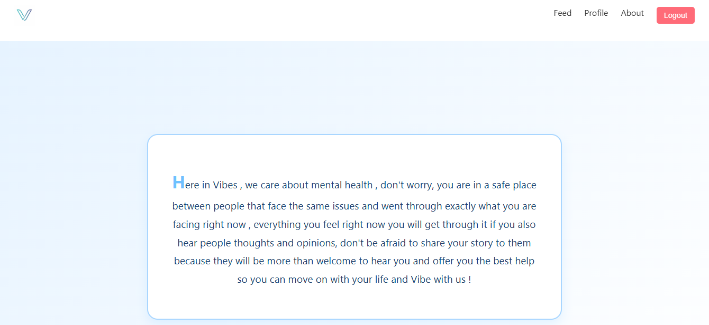

# Vibes

## What is Vibes

- Vibes is a social media web application that let users interact with each others via posts and comments and likes about mental health status and designed to let them help each other about what they experience in life and how do they get through their problems.

- every user in this application have his own story that he would like to share with people and let them know how he dealt with his issue or situation to help other people that is facing the same problem he faced before.

- Till now, we simply have a login and a register page where people can create their account and login and a feed page that let people post their current Vibe or problem, and a profile page that also shows all the posts that the user posted.

- this was a wireframe before creating the web app

- Login page

- Ai listener chatbot 

this amazing feature allows the user to use Ai to express his feelings and interact with him and the Ai responds
as a good listener

- this is Vibes